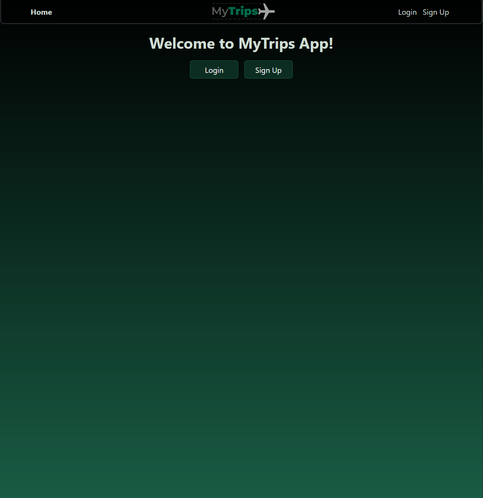

# MyTrips - Your Everyday Trip Tracker
Full Stack MERN Application

----------------------------------------------------------------------

# Description
Welcome to MyTrips! MyTrips is a website that allows a user to track their upcoming trips. Users can store all of their upcoming trips and attach them to their personal accounts. By entering travel destinations and travel dates, a log is stored. This tool is for the active traveler that just needs a simple way to keep track of their upcoming travels.

----------------------------------------------------------------------

# Tabel of Contents
1. [Title](#mytrips---your-everyday-trip-tracker)
2. [Purpose](#purpose)
3. [Preview](#preview)
4. [Link](#link)
5. [Built Using](#built-using)
6. [Future Development](#possible-development)
7. [Contributors](#contributors)
8. [License](#license)

----------------------------------------------------------------------

# Purpose
The need for a central place to store trip details and a travel log managed by the traveler themselves to ease accessibility.

----------------------------------------------------------------------
## User Story

```
AS an active traveler
I WANT to be able to keep track of all my trips and keep a log of all my travels for each trip 
SO THAT I can have this information handy whenever I need to claim travel points, for budgeting purposes, or simply to get a hold of your travels  
```

## Acceptance Criteria

```
GIVEN a trip details logging application

WHEN a user logs in or signs up
THEN the user is redirected to the home page

GIVEN a prompt for submitting travel data
WHEN the user enters a destination & date
THEN a card will appear displaying the logged information

WHEN the user selects the edit or delete buttons 
THEN the user will be able to edit or delete respective trip data.
```
----------------------------------------------------------------------

# Preview



----------------------------------------------------------------------

# Link
Heroku Deployment Link: https://my-trips.herokuapp.com

----------------------------------------------------------------------

# Built Using
- ReactJS
- ExpressJS
- NodeJS
- MongoDB
- Mongoose
- Apollo GraphQL
- JWT
- Bcrypt
- React Bootstrap
- CSS 3
- Heroku
- Git

----------------------------------------------------------------------

# Future Development
- Integrate a weather API to show weather forecasts at travel destinations
- Integrate a countdown to travel day feature
- Integrate map API to show specific locations
- Add a feature to incorporate day planners for each day of the trip
- Add ability to store full itineraries 
- Add feature where users can log accommodations, attraction sights, restaurants, & cafes
- A mobile friendly app

----------------------------------------------------------------------

# Contributors
- Kyle Hipple - https://github.com/KlyDesign
- Joel John - https://github.com/jo3kr
- Khevin Brahmbhatt - https://github.com/khevb27

----------------------------------------------------------------------

# License
Deployment Date: March 16, 2023 \
Version 1.0
This project is licensed under the MIT License.
See LICENSE for more information.